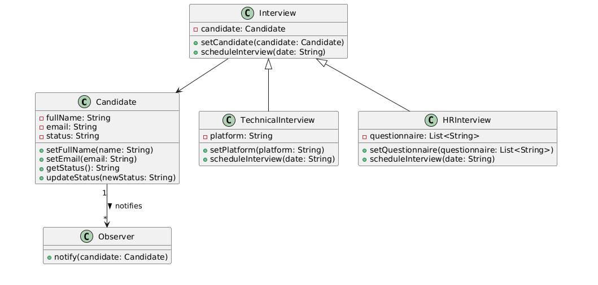

# Mini-Project-2: Advanced Interview Management System

## Project Overview
In this project, you will build an advanced interview management system to manage the scheduling, tracking, and evaluation of candidates throughout the interview process. The goal of this project is to enhance your understanding of object-oriented programming (OOP) concepts, introduce advanced design patterns, and work with more complex system features such as multi-threading and candidate evaluation.

The system should be capable of handling different types of interviews (technical and HR) for multiple candidates, storing candidate information, managing interview schedules, tracking interview progress and status, and evaluating candidates based on their performance.

### Objectives
You will be expected to demonstrate skills in:
- Object-oriented programming, including inheritance, encapsulation, and polymorphism.
- Design pattern implementation, specifically Observer Pattern.
- Data structure handling and collection management.
- Thread and concurrency management using JavaScript asynchronous capabilities.
- Implementing interview rating and reminder systems.

### Reference Materials
For this project, you may find the following resources helpful:

1. **Observer Pattern in JavaScript**:
   - [GeeksforGeeks - Observer Method JavaScript Design Pattern](https://www.geeksforgeeks.org/observer-method-javascript-design-pattern/)

2. **Asynchronous Programming in JavaScript**:
   - [MDN - async/await](https://developer.mozilla.org/en-US/docs/Web/JavaScript/Reference/Statements/async_function)
   - [MDN - Using Promises](https://developer.mozilla.org/en-US/docs/Web/JavaScript/Guide/Using_promises)

### Requirements
Below are the detailed requirements for this project:

### 1. Candidate Class and Interview Status Tracking (1 Point)
- **Candidate Class**: Create a `Candidate` class to represent a candidate.
  - Properties should include `fullName`, `email`, and `status` (e.g., `Not Scheduled`, `Scheduled`, `In Progress`, `Passed`, `Failed`).
  - Methods to include `setFullName()`, `setEmail()`, `getStatus()`, and `updateStatus(newStatus)`. The status should be updated based on the interview progress.

- **Status Management**:
  - Implement a status management system that can track the interview status of each candidate.
  - Candidates should transition through statuses during the interview process, and status changes should be appropriately logged.

### 2. Observer Pattern for Status Updates (1 Point)
- Create an `Observer` class to observe changes in the candidate's status.
  - The `Observer` should be notified whenever a candidate's status is updated.
  - For each status update, print a notification message to simulate sending an email, e.g., "Candidate John Smith's status has been updated to: Passed".

### 3. Candidate Database (1 Point)
- Use a collection (such as an array or `Set`) to maintain all candidates in the system.
- Implement methods to:
  - **Add Candidate**: Add a new candidate to the collection.
  - **Remove Candidate**: Remove a candidate from the collection.
  - **Find Candidate by Name**: Find a candidate by their full name.
  - **Filter Candidates by Status**: Filter candidates based on their current status.

### 4. Parallel Interview Scheduling (1 Point)
- Implement parallel interview scheduling using JavaScript's asynchronous capabilities.
  - Interviews should be scheduled concurrently to simulate multiple interviewers conducting interviews simultaneously.
  - Ensure that there are no scheduling conflicts by managing interview times appropriately.
  - Implement a method `scheduleParallelInterviews()` that takes a list of interviews and schedules them concurrently, ensuring that all interview-related information (date, candidate, type) is properly printed to the console.

### 5. Interview Scoring System (1 Point)
- **Interview Scoring**: After the completion of each interview, the interviewer should be able to provide a score for the candidate.
  - Scores should be between 1 and 10.
  - Store the score in the candidate's record.
  - Implement logic to determine if a candidate has passed the interview based on the score threshold (e.g., scores >= 7 indicate a pass).

- **Pass/Fail Update**: The candidate's status should automatically be updated to `Passed` or `Failed` after the interview score is recorded.

### 6. Interview Reminders (1 Point)
- **Interview Reminder System**: Implement a reminder system for interviews.
  - Print reminders for candidates and interviewers the day before the interview, simulating email reminders.
  - Reminders should include the interview type, candidate name, date, and platform.
  - The reminder should be printed in the following format:
    - "Reminder: Candidate John Smith has a Technical Interview scheduled for tomorrow at HackerRank."

### UML Diagram
To help you understand the relationships between the different classes, a UML diagram (similar to UML.PNG) is provided below. Make sure to use class inheritance, encapsulation, and observer relationships as indicated in the diagram.



### Expected Output
Your program should print the following:
1. **Interview Scheduling**: Messages indicating that interviews have been scheduled.
2. **Status Update Notifications**: Observer messages indicating that the status of candidates has changed.
3. **Reminder Messages**: Reminders sent the day before an interview.
4. **Score Recording**: Messages indicating that a score has been given to a candidate and their status has been updated accordingly.

#### Example Output
```
Scheduling interview for John Smith...
Candidate John Smith's status has been updated to: Scheduled
An interview was scheduled with John Smith at Jan. 1st
Interview questionnaire Q1, Q2, Q3 will be sent to john@gmail.com
Scheduling interview for John Smith...
Candidate John Smith's status has been updated to: Scheduled
An interview was scheduled with John Smith at Feb. 1st
Interview platform HackerRank is configured
Scheduling interview for Alice Wonder...
Candidate Alice Wonder's status has been updated to: Scheduled
An interview was scheduled with Alice Wonder at March 1st
Interview questionnaire Q1, Q2, Q3 will be sent to alice@gmail.com
Scheduling interview for Alice Wonder...
Candidate Alice Wonder's status has been updated to: Scheduled
An interview was scheduled with Alice Wonder at April 1st
Interview platform HackerRank is configured
Reminder: Candidate John Smith has a Technical Interview scheduled for tomorrow at HackerRank.
Reminder: Candidate Alice Wonder has a HR Interview scheduled for tomorrow at HackerRank.
Interview completed for John Smith with a score of 8
Candidate John Smith's status has been updated to: Passed
Interview completed for Alice Wonder with a score of 6
Candidate Alice Wonder's status has been updated to: Failed
```


### Example Test Case
Below is an example test case that calls the functions to implement the expected output:

```javascript
// Create candidates
let candidate1 = new Candidate('John Smith', 'john@gmail.com');
let candidate2 = new Candidate('Alice Wonder', 'alice@gmail.com');

// Create observers and add to candidates
let observer = new Observer();
candidate1.addObserver(observer);
candidate2.addObserver(observer);

// Create interviews
let hrInterview1 = new HRInterview(candidate1);
hrInterview1.setQuestionnaire(['Q1', 'Q2', 'Q3']);
let techInterview1 = new TechnicalInterview(candidate1);
techInterview1.setPlatform('HackerRank');

let hrInterview2 = new HRInterview(candidate2);
hrInterview2.setQuestionnaire(['Q1', 'Q2', 'Q3']);
let techInterview2 = new TechnicalInterview(candidate2);
techInterview2.setPlatform('HackerRank');

// Schedule interviews concurrently
scheduleParallelInterviews([
  { interview: hrInterview1, date: 'Jan. 1st' },
  { interview: techInterview1, date: 'Feb. 1st' },
  { interview: hrInterview2, date: 'March 1st' },
  { interview: techInterview2, date: 'April 1st' }
]);

// Send reminders
sendInterviewReminder({ candidate: candidate1, type: 'Technical', platform: 'HackerRank' });
sendInterviewReminder({ candidate: candidate2, type: 'HR', platform: 'HackerRank' });

// Record interview scores
recordInterviewScore(candidate1, 8);
recordInterviewScore(candidate2, 6);
```


### Evaluation Criteria
Each requirement has a specific point value, as described below. The total score for the assignment is 6 points, with detailed rubrics to guide how these points are distributed for each requirement.

### Detailed Rubric for Each Requirement
1. **Candidate Class and Interview Status Tracking (1 Point)**
   - **Full Marks (1 Point)**: Proper implementation of the `Candidate` class with attributes (`fullName`, `email`, `status`). The status management should include appropriate methods (`updateStatus()`) that correctly update and track candidate statuses.
   - **Partial Marks (0.5 Point)**: Implementation is mostly correct but with minor issues, such as missing a method or improper encapsulation of fields.
   - **No Marks (0 Point)**: Major issues or incomplete implementation of the `Candidate` class. Missing key functionality, such as status updates.

2. **Observer Pattern for Status Updates (1 Point)**
   - **Full Marks (1 Point)**: Correct implementation of the Observer pattern. Observers are properly notified when the candidate's status changes, and the output correctly reflects the notifications.
   - **Partial Marks (0.5 Point)**: Observer pattern is implemented but with minor issues, such as incorrect observer notifications or incomplete observer attachment.
   - **No Marks (0 Point)**: Observer pattern is missing or incorrectly implemented, such as failing to notify observers properly.

3. **Candidate Database (1 Point)**
   - **Full Marks (1 Point)**: A collection is used appropriately to manage candidates, with methods to add, remove, find, and filter candidates. The implementation correctly handles all specified operations.
   - **Partial Marks (0.5 Point)**: Most functionality is implemented correctly, but minor issues exist, such as incorrect filtering or missing validation.
   - **No Marks (0 Point)**: Collection management is either missing or incorrect. Key methods such as adding or finding candidates are not implemented properly.

4. **Parallel Interview Scheduling (1 Point)**
   - **Full Marks (1 Point)**: Interviews are scheduled concurrently using `Promise.all()` or similar asynchronous mechanisms. No conflicts or major issues occur during scheduling.
   - **Partial Marks (0.5 Point)**: Concurrent scheduling is implemented, but there are minor issues, such as incorrect async/await usage or some minor scheduling conflicts.
   - **No Marks (0 Point)**: Concurrent scheduling is incorrect or missing. Interviews are scheduled sequentially without using asynchronous techniques, or there are major errors.

5. **Interview Scoring System (1 Point)**
   - **Full Marks (1 Point)**: The scoring system is implemented correctly, with candidate statuses (`Passed` or `Failed`) updated based on their scores. Thresholds are handled accurately.
   - **Partial Marks (0.5 Point)**: Scoring system is mostly implemented but with minor issues, such as incorrect threshold handling or missing score validation.
   - **No Marks (0 Point)**: Scoring system is missing or majorly flawed, such as failing to update the candidate status based on scores.

6. **Interview Reminders (1 Point)**
   - **Full Marks (1 Point)**: Reminder system is implemented correctly, with reminders being sent the day before an interview. The reminders include all necessary details.
   - **Partial Marks (0.5 Point)**: Reminders are implemented but contain minor issues, such as incorrect timing or incomplete details.
   - **No Marks (0 Point)**: Reminders are missing or incorrectly implemented, such as failing to include critical details or sending them at the wrong time.

### Additional Evaluation Criteria (Code Quality)
1. **Code Quality, Readability, and Documentation (Up to -1 Point Penalty)**
   - **Full Marks (No Deduction)**: Code is well-structured, readable, and follows standard conventions. Adequate commenting and documentation are provided.
   - **Minor Issues (-0.5 Point)**: Code is readable, but there are minor issues, such as inconsistent formatting or missing comments in parts of the code.
   - **Major Issues (-1 Point)**: Code is poorly structured, lacks documentation, and is difficult to follow. Code conventions are not adhered to, making the implementation confusing.


Good luck, and happy coding!